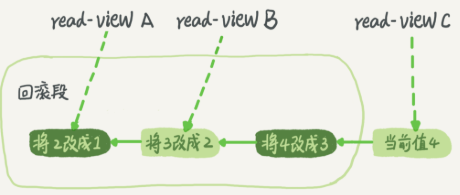

# mysql实战系列2

## 事务隔离

> 事务就是要保证一组数据库操作，要么全部成功，要么全部失败

在mysql中，事务支持是在引擎层实现的。

> MyISAM引擎不支持事务

### 隔离性与隔离级别

**ACID** (Atomicity, Consistency, Isolation, Durability，也就是原子性、一致性、隔离性、持久性，本次要讨论的是隔离性

当数据库上有多个事务同时执行的时候，就有可能出现脏读(dirty read)，不可重复读(nonreapeatable read)， 幻读(phantom read)等问题，为了解决这些问题，就有了“隔离级别”的概念。

*隔离的越严格，效率就会越低*

SQL标准的事务隔离级别包括：读未提交(read uncommitted)、读提交(read committed)、可重复读(repeatable read)、串行读(serializable)

* 读未提交：指一个事务还没有提交时，他做的变更就能被别的事务看到。
* 读提交：一个事务提交之后，它做的变更才会被其他事物看到。
* 可重复读：指事务执行过程中看到的数据，总是跟这个事务在启动时看到的数据是一直的。在此级别下，未提交变更对其他事物也是不可见的。
* 串行化：对于同一行记录，“写”会加“写锁”，“读”会加“读锁”。当出现读写锁冲突的时候，后访问的事务必须等前一个事务执行完成，才能继续执行。

在实现上，数据库会创建一个视图，访问的时候以视图的逻辑结果为准。

* 在“可重复读”隔离级别下，这个视图是在事务启动时创建的，整个事务存在期间都用这个视图。
* 在“读提交”隔离级别下，这个视图是在每个sql语句开始执行的时候创建的。
* “读未提交”隔离级别下直接返回记录上的最新值，没有视图的概念
* 在“串行化”隔离级别下，直接用加锁的方式来避免并行访问

配置隔离级别的方式是设置启动参数`transaction-isolation`，可以用`show variables`来查看当前的值，例如`show variablees like ‘transaction-isolation’`即可查看当前数据库的隔离级别。

 ### 事务隔离的实现

在mysql中，实际上每一条记录在更新的时候都会同时记录一条回滚操作。记录上的最新值，通过回滚操作，都可以得到前一个状态的值。

假设一个值从1被按顺序依次改成了2、3、4，在回滚日志里面就会有类似下面的记录。




当前值是4，但是在查询这条记录的时候，不同时刻启动的事务会有不同的read-view。也就是说，同一条记录在系统中会存在多个版本，就是数据库的多版本并发控制(MVCC)

回滚日志不会一直保留，系统会判断，当没有事务在需要用到这些回滚日志时，回滚日志会被删除。也就是说，当系统里没有比这个回滚日志更早的read-view的时候，就会删除。

基于上面的内容，**建议尽量不要使用长事务**，因为长事务导致数据库必须要保存很老的事务视图，数据库里面他可能用到的回滚记录则必须保留，这就会导致大量对的占用存储空间。

除了对回滚段的影响，长事务还会占用锁资源。

### 事务的启动方式

mysql的事务启动方式有以下几种：

1. 显式启动事务语句，`begin`或`start transaction`。配套的提交语句是`commit`，回滚语句是`rollback`。
2. `set autocommit=0`，这个命令会将这个线程的自动提交关掉。也就是说如果你只执行一个`select`语句，这个事务就开始了，而且并不会自动提交。这个事务持续存在知道你主动执行`commit`或`rollback`语句，或者断开连接。

有些客户端框架会**默认连接成功后先执行一个`set autocommit=0`的命令**。这就导致接下来查询都在事务中，如果是长连接，就导致了意外的长事务。

因此，建议总是使用`set autocommit=1`，通过显示语句的方式来启动事务。

在autocommit为1的情况下，可以用`commit work and chain`来“多一次交互”的问题。该语法的作用是提交事务并自动启动下一个事务，这样省去了再次执行begin语句的开销。

可以在information_schema库的innodb_trx这个表中查询长事务，下面语句用来查询持续时间超过60s的事务。

```mssql
select * from information_schema.innodb_trx where TIME_TO_SEC(timediff(now(),trx_started))>60
```

